# IWNO6: Interacțiunea containerelor

* **Autor:** Straton Alexandru  
* **Grupa:** IA-2302  
* **Data:** 11.04.2025  

## Scop
Scopul acestei lucrări este familiarizarea cu gestionarea unei aplicații multi-container utilizând `docker-compose`, dezvoltarea competențelor în configurarea și interacțiunea între containere Docker, precum și înțelegerea modului de asigurare a funcționării corecte a unui site `PHP` bazat pe `Nginx`, `PHP-FPM` și `MariaDB`.

## Sarcina
Crearea unei aplicații PHP funcționale bazate pe trei containere Docker: 
- `Nginx` (frontend) pentru gestionarea fișierelor statice și direcționarea cererilor PHP
- `PHP-FPM` (backend) pentru procesarea codului PHP
- `MariaDB` (database) pentru stocarea datelor
Configurate să comunice printr-o `rețea internă`, cu site-ul accesibil pe portul `80` al gazdei, utilizând `docker-compose` pentru orchestrare.

--- 

### 1. Crearea unui proiect
 - Crearea unui *repository* pe GitHub
    - Tastăm butonul `New`  
        

    - Introducem datele repository-ului  
      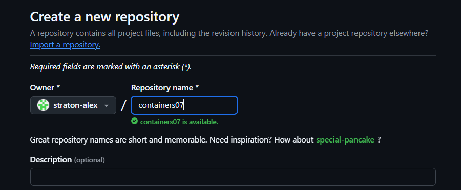  

--- 

### 2. Clonarea repository-ului pe calculatorul local

 1. În repository-ul creat tastăm Code -> Local -> Clone -> HTTPS, copiem link-ul.  
      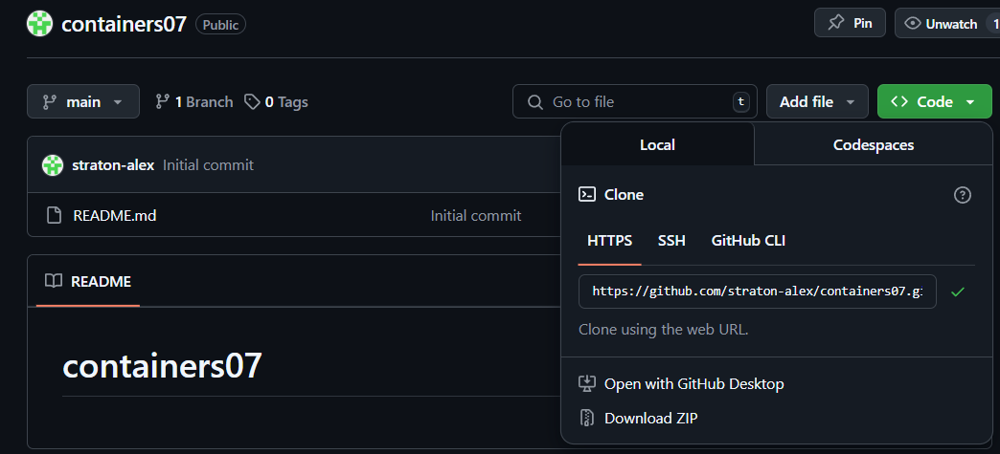  

 2. Deschidem Visual Studio sau alt IDE dorit.  
      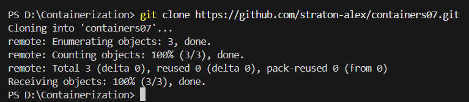  

 3. Introducem comanda pentru clonare în consolă

    ```bash
    git clone https://github.com/straton-alex/containers07.git
    cd containers07
    ```

--- 

### 3. Structura Proiectului

**1. Crearea structurii proiectului**
- Creează directorul principal al proiectului și subdirectoarele necesare:
    ```bash
    mkdir mounts
    cd mounts
    mkdir site
    ```
    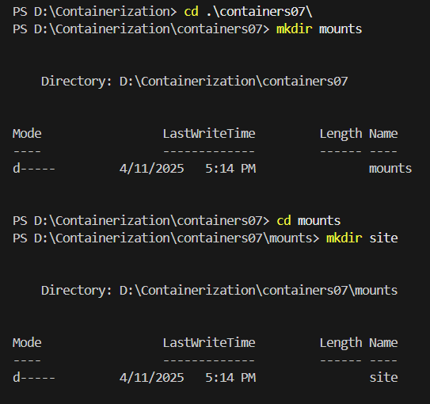  

- Directorul `mounts\site` va conține fișierele site-ului PHP. Copiază aici site-ul creat în cursul `„Programare PHP”`. Dacă nu ai un site, creează un fișier de test:

    ```bash
    echo '<?php phpinfo();' > mounts/site/index.php
    ```
    > Acest fișier simplu afișează informații despre configurația PHP, fiind util pentru testare.

**2. Configurarea .gitignore**

- Creează fișierul `.gitignore` pentru a exclude fișierele site-ului din controlul versiunii:

    ```bash
    cd ..
    New-Item -ItemType File -Name ".gitignore"
    ```
    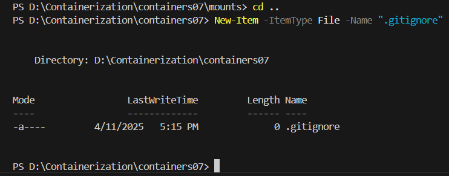  

    și adăugați următoarele linii:

    ```bash
    # Ignore files and directories
    mounts/site/*
    ```
    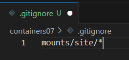  

**3. Configurarea Nginx**

- Creați în directorul `containers07` fișierul `nginx/default.conf`
    ```bash
    mkdir nginx
    cd nginx
    New-Item -ItemType File -Name "default.conf"
    ```
    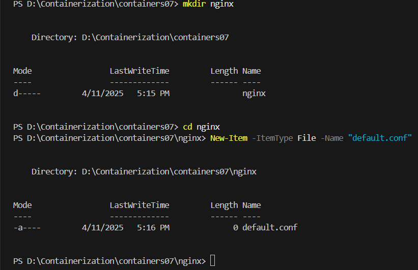  

    cu următorul conținut:

    ```bash
    server {
        listen 80;
        server_name _;
        root /var/www/html;
        index index.php;
        location / {
            try_files $uri $uri/ /index.php?$args;
        }
        location ~ \.php$ {
            fastcgi_pass backend:9000;
            fastcgi_index index.php;
            fastcgi_param SCRIPT_FILENAME $document_root$fastcgi_script_name;
            include fastcgi_params;
        }
    }
    ```
    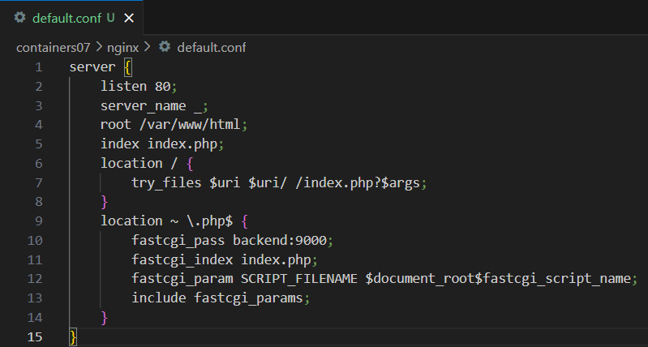 


    - **Explicație**:
        - `listen 80`: Nginx ascultă pe portul 80.
        - `root /var/www/html\`: Setează directorul rădăcină al site-ului.
        - `index index.php`: Definește fișierul implicit ca fiind `index.php`.
        - `location /`: Gestionează cererile pentru fișiere statice sau redirecționează către PHP.
        - `location ~ \.php$`: Configurează procesarea fișierelor PHP prin `FastCGI`, trimițând cererile către containerul `backend` pe portul `9000`.

---
### 4. Configuarea Docker Compose

- Creați în directorul `containers06` fișierul `docker-compose.yml` 

    ```bash
        cd ..
        New-Item -ItemType File -Name "docker-compose.yml"
    ```

    cu următorul conținut:

    ```bash
    version: '3.9'

    services:
    frontend:
        image: nginx:1.19
        volumes:
        - ./mounts/site:/var/www/html
        - ./nginx/default.conf:/etc/nginx/conf.d/default.conf
        ports:
        - "80:80"
        networks:
        - internal
    backend:
        image: php:7.4-fpm
        volumes:
        - ./mounts/site:/var/www/html
        networks:
        - internal
        env_file:
        - mysql.env
    database:
        image: mysql:8.0
        env_file:
        - mysql.env
        networks:
        - internal
        volumes:
        - db_data:/var/lib/mysql

    networks:
    internal: {}

    volumes:
    db_data: {}
    ```
    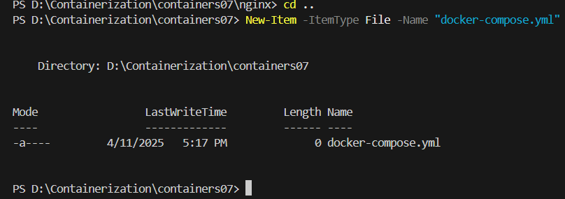

### 5. Configuarea .env

- Creați file-ul `mysql.env` în rădăcina proiectului 

    ```bash
    cd ..
    New-Item -ItemType File -Name "mysql.env"
    ```

    și adăugați în el următoarele linii:

    ```bash
    MYSQL_ROOT_PASSWORD=secret
    MYSQL_DATABASE=app
    MYSQL_USER=user
    MYSQL_PASSWORD=secret
    ```

    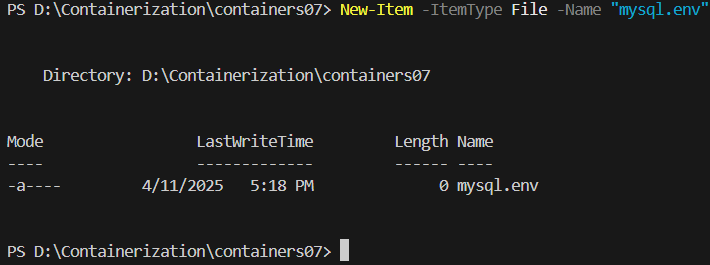 

- Fișierul `.env` nu ar trebui să fie public deoarece conține informații sensibile, cum ar fi:

    - Credențiale de acces: Parole, nume de utilizatori sau chei `API `(ex. `MYSQL_ROOT_PASSWORD,` `MYSQL_USER`, `MYSQL_PASSWORD`) care, dacă sunt expuse, pot permite accesul neautorizat la baze de date sau alte servicii.
    - Securitatea aplicației: Expunerea variabilelor de mediu poate compromite securitatea întregii aplicații, permițând atacatorilor să exploateze configurațiile sau să acceseze date confidențiale.
    - Riscuri de conformitate: Dacă aplicația stochează date personale, expunerea fișierului `.env` poate duce la încălcarea reglementărilor precum GDPR sau alte standarde de protecție a datelor.
    - Integritatea sistemului: Informațiile din `.env` pot fi folosite pentru a manipula sau distruge infrastructura, cum ar fi modificarea configurațiilor sau ștergerea datelor din baza de date.

    Pentru a preveni expunerea fișierului `mysql.env` și a altor fișiere sensibile sau inutile în repozitoriul tău, ar trebui să adaugi următoarele linii în fișierul `.gitignore` din rădăcina proiectului (`containers07`):

    ```bash
    mysql.env
    ```
---
### 6. Testarea aplicației
- Porniți containerele cu comanda:


    ```bash
    docker-compose up -d
    ```
    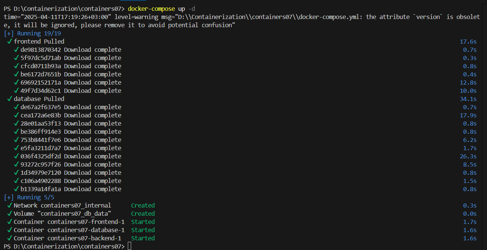 
    </br>
- Deschide un browser și accesează `http://localhost`. Dacă apare pagina implicită `Nginx`, reîncarcă pagina pentru a vedea rezultatul `PHP`

    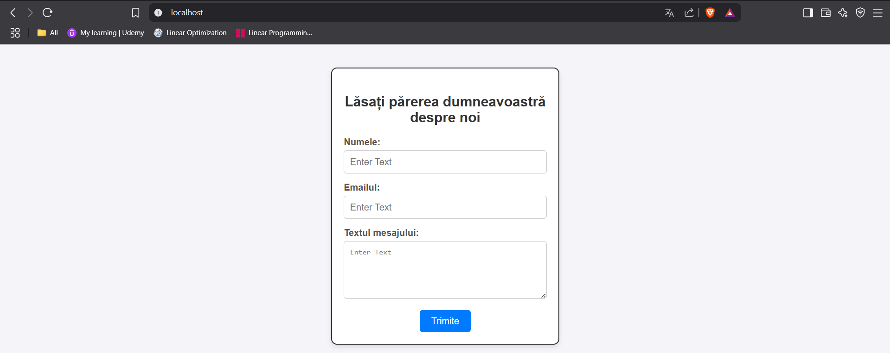 
    > Proiectul este conectat la baza de date MySQL cu credențialele pe care le-am indicat în fișierul `mysql.env`.

    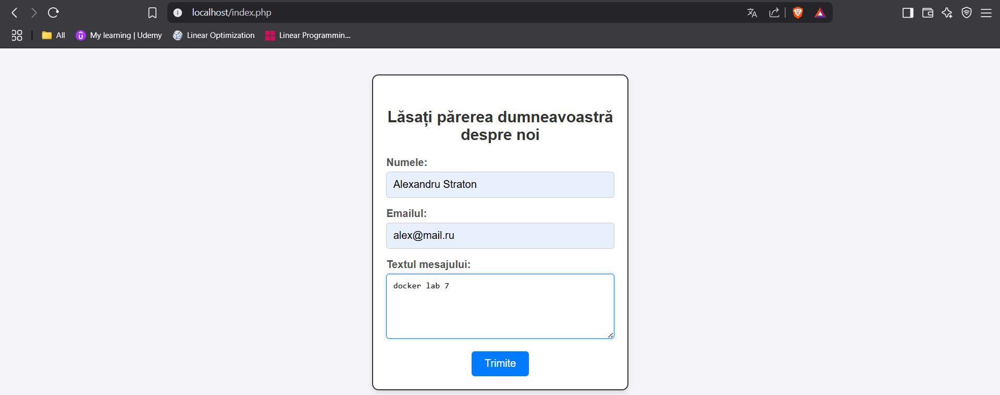 
    > Încercăm să adăugăm o recenzie.

    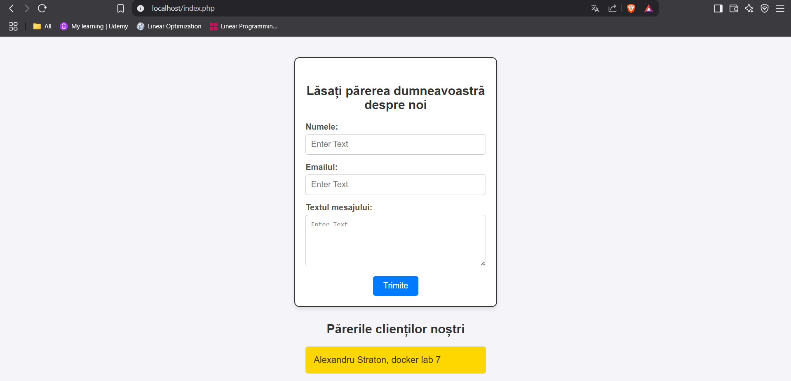 
    > Recenzia este extrasă din baza de date.
    

### 7. Publicarea codului pe GitHub

> Publicăm codul pe GitHub

```bash
# adăugăm toate fișierele pentru tracking
git add .
# creăm un commit
git commit -m "lab07"
# împingem în branch-ul principal
git push origin main
```

--- 

### 8. Răspunsuri la întrebări

1. **În ce ordine sunt pornite containerele?**

    - Ordinea în care sunt pornite containerele definite în fișierul `docker-compose.yml` nu este strict determinată de ordinea în care sunt listate în fișier, ci depinde de dependențele implicite și de configurația rețelei și volumelor. 
    În cazul proiectului descris, fișierul `docker-compose.yml` nu specifică explicit dependențe între servicii folosind `depends_on`. Prin urmare, `Docker Compose` pornește containerele în mod concurent, dar cu anumite considerații:

    - Containerele implicate:

        - frontend (Nginx)
        - backend (PHP-FPM)
        - database (MariaDB)

    - Comportamentul `Docker Compose`:

        - `Docker Compose` încearcă să pornească toate containerele simultan.
        Totuși, dacă un container depinde de altul pentru a funcționa corect (de exemplu, `frontend` depinde de `backend` pentru procesarea cererilor `PHP`, iar `backend` depinde de `database` pentru conexiunea la baza de date), containerul care are nevoie de altul va aștepta până când dependențele sunt disponibile, datorită configurației `rețelei interne` (internal).

    - Deși `Docker Compose` pornește containerele concurent, ordinea efectivă de funcționare tinde să fie:

        1. `database (MariaDB)`
        2. `backend (PHP-FPM)`
        3. `frontend (Nginx)`
  
2. **Unde sunt stocate datele bazei de date?**

   - Datele bazei de date sunt stocate într-un volum `Docker` numit `db_data`, montat în containerul database la calea `/var/lib/mysql`. 
   Pe gazdă, acestea se află într-un director gestionat de `Docker`, de obicei în `/var/lib/docker/volumes`.
3. **Cum se numesc containerele proiectului?**

   - Numele containerelor proiectului sunt generate automat de `Docker Compose` pe baza numelui proiectului și al serviciilor definite în fișierul `docker-compose.yml`. În cazul dat, proiectul se află în directorul `containers07`, iar serviciile definite sunt `frontend`, `backend` și `database`.
   - Numele containerelor:
        Pe baza configurației furnizate, containerele vor fi numite:

        - Pentru serviciul `frontend`: `containers07_frontend_1`
        - Pentru serviciul `backend`: `containers07_backend_1`
        - Pentru serviciul `database`: `containers07_database_1`

    Putem confirma aceste nume rulând comanda:

    ```bash
    docker ps
    ```
    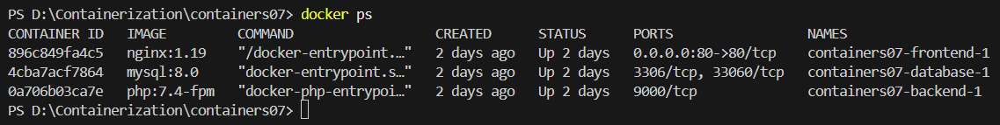 

4. **Trebuie să adăugați încă un fișier `app.env` cu variabila de mediu `APP_VERSION` pentru serviciile `backend` și `frontend`. Cum se face acest lucru?**

- Pentru a adăuga un fișier `app.env` cu variabila de mediu `APP_VERSION` pentru serviciile `backend` și `frontend`, urmează acești pași:

    1. Creează fișierul `app.env`
    - În rădăcina proiectului (containers07), creează fișierul `app.env`:
        ```bash
        New-Item -ItemType File -Name "app.env"
        ```
        Adaugă următoarea linie în fișierul `app.env`

        ```bash
        APP_VERSION=1.0.0
        ```

    2. Actualizează fișierul `docker-compose.yml`

    - Modifică fișierul `docker-compose.yml` pentru a include fișierul `app.env `în serviciile `frontend` și `backend`. 
    Adaugă directiva `env_file `pentru ambele servicii, astfel încât să arate așa:

        ```bash
        version: '3.9'

        services:
        frontend:
            image: nginx:1.19
            volumes:
            - ./mounts/site:/var/www/html
            - ./nginx/default.conf:/etc/nginx/conf.d/default.conf
            ports:
            - "80:80"
            networks:
            - internal
            env_file:
            - app.env
        backend:
            image: php:7.4-fpm
            volumes:
            - ./mounts/site:/var/www/html
            networks:
            - internal
            env_file:
            - mysql.env
            - app.env
        database:
            image: mysql:8.0
            env_file:
            - mysql.env
            networks:
            - internal
            volumes:
            - db_data:/var/lib/mysql

        networks:
        internal: {}

        volumes:
        db_data: {}
        ```
    3. Adaugă `app.env` în `.gitignore`

    - Pentru a preveni expunerea fișierului `app.env` (care ar putea conține informații sensibile în viitor), adaugă-l în fișierul `.gitignore`:
        ```bash
        app.env
        ```
    4. Repornește containerele
    - Pentru ca modificările să intre în vigoare, repornește containerele:
        ```bash
        docker-compose down
        docker-compose up -d
        ```
--- 
### 9. Concluzie

Această lucrare a oferit o experiență practică în gestionarea unei aplicații multi-container utilizând `Docker Compose`, consolidând competențele în orchestrarea containerelor `Docker`. Am învățat să:

- Configurez și să lansez o aplicație `PHP` bazată pe trei containere: `Nginx`, `PHP-FPM` și `MariaDB`, utilizând `docker-compose`.
- Creez și să gestionez fișiere de configurare, cum ar fi `docker-compose.yml`, `nginx/default.conf` și fișiere de mediu (`mysql.env`).
- Stabilesc o `rețea internă` pentru comunicarea securizată între containere.
- Montez volume pentru a partaja fișierele aplicației și pentru a persista datele bazei de date.
- Testez și să verific funcționarea aplicației accesând site-ul la `http://localhost`.

Rezultatul final a fost o aplicație `PHP` funcțională, cu o separare clară a responsabilităților:
- `Nginx` pentru gestionarea cererilor statice și direcționarea celor dinamice
- `PHP-FPM` pentru procesarea codului `PHP` și `MariaDB` pentru stocarea datelor. 

Această abordare modulară și scalabilă demonstrează avantajele utilizării `Docker Compose` pentru dezvoltarea și gestionarea aplicațiilor web complexe.

--- 

### 10. Bibliografie

*1. Curs Moodle USM, Containerizarea și Virtualizarea*

*2. Documentația oficială Docker – https://docs.docker.com/*

*3. Markdown Guide – https://www.markdownguide.org/*
